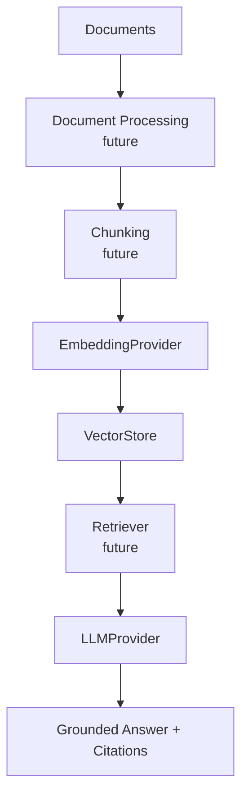

# DocIntel RAG

A local-first Retrieval-Augmented Generation platform for document ingestion, semantic retrieval, grounded question answering, source citations, and retrieval evaluation.

## Overview

DocIntel RAG is an original AI engineering portfolio and client-demo project. It is designed to help teams query trusted document collections such as policy manuals, support documentation, technical references, contracts, and research archives.

Phase 1 establishes the project foundation without hiding the architecture behind a RAG framework. Retrieval, chunking, vector storage, APIs, and UI work are intentionally reserved for later phases.

## Why RAG

Large language models are powerful, but they do not automatically know private or changing business documents. Retrieval-Augmented Generation connects a model to relevant source passages at answer time, which improves grounding, allows citations, and makes document intelligence systems easier to inspect and evaluate.

## Project Goals

- Ingest and normalize useful document collections.
- Split documents into retrievable chunks.
- Generate embeddings with swappable providers.
- Store and search vectors locally.
- Answer questions using retrieved context.
- Return source citations with grounded answers.
- Evaluate retrieval and answer quality.

## Architecture



## Current Phase 1 Capabilities

- Python project structure for a RAG platform.
- Pydantic settings loaded from environment variables and `.env`.
- Ollama LLM provider using the OpenAI-compatible endpoint.
- Sentence-transformers embedding provider with lazy model loading.
- Domain models for documents, chunks, embedded chunks, and citations.
- Vector store interface prepared for a future ChromaDB implementation.
- Health service for configuration and Ollama reachability checks.
- CLI smoke tests for local generation and embeddings.
- Unit tests with mocked external dependencies.
- Ruff lint configuration.

## Technology Stack

- Python 3.12+
- uv
- Ollama
- OpenAI-compatible Ollama endpoint
- sentence-transformers
- Pydantic
- pydantic-settings
- python-dotenv
- pytest
- Ruff

LangChain, ChromaDB, FastAPI, Gradio, and document parsers are intentionally not included in Phase 1.

## Prerequisites

- Python 3.12 or newer
- uv
- Ollama installed locally
- At least one supported local Ollama model, such as `llama3.2`

## Ollama Setup

Install Ollama from the official project site, then pull the default generation model:

```bash
ollama pull llama3.2
```

Optional Gemma smoke test support:

```bash
ollama pull gemma3
```

DocIntel uses Ollama's OpenAI-compatible endpoint:

```text
http://localhost:11434/v1
```

## uv Setup

Install dependencies:

```bash
uv sync
```

Copy the example environment file if you want local overrides:

```bash
cp .env.example .env
```

No OpenAI API key is required.

## Running Health Checks

```bash
uv run python -m app.main
```

Expected output shape:

```text
DocIntel RAG
Ollama: reachable
Generation model: llama3.2
Embedding model: sentence-transformers/all-MiniLM-L6-v2
```

## LLM Smoke Tests

Default model:

```bash
uv run python -m app.main --llm-test
```

Gemma model override:

```bash
uv run python -m app.main --llm-test --model gemma3
```

## Embedding Smoke Test

```bash
uv run python -m app.main --embedding-test
```

This prints the configured embedding model and vector dimension, not the full vector.

## Client Demo Direction

The finished system is intended to support demo collections such as:

- Employee Handbook
- Company Policies
- Product Documentation
- Customer Support Knowledge Base

These demo collections are not built in Phase 1.

## Planned Roadmap

1. Core providers & domain foundation ✅
2. Document ingestion
3. Chunking, embeddings & ChromaDB
4. Retrieval & grounded Q&A
5. RAG evaluation
6. FastAPI backend
7. Gradio client demo
8. Observability, deployment & portfolio release

## Development

Run unit tests:

```bash
uv run pytest
```

Run lint checks:

```bash
uv run ruff check .
```
