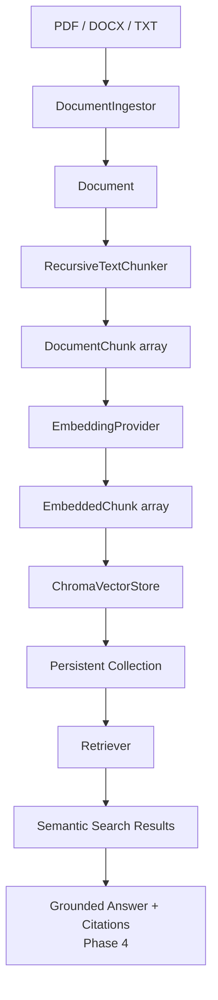

# DocIntel RAG

A local-first Retrieval-Augmented Generation platform for document ingestion, semantic retrieval, grounded question answering, source citations, and retrieval evaluation.

## Overview

DocIntel RAG is an original AI engineering portfolio and client-demo project. It is designed to help teams query trusted document collections such as policy manuals, support documentation, technical references, contracts, and research archives.

Phase 3 adds document chunking, batch embedding generation, persistent ChromaDB vector storage, idempotent indexing, and semantic search. Grounded LLM question-answering, APIs, and UI work are intentionally reserved for later phases.

## Why RAG

Large language models are powerful, but they do not automatically know private or changing business documents. Retrieval-Augmented Generation connects a model to relevant source passages at answer time, which improves grounding, allows citations, and makes document intelligence systems easier to inspect and evaluate.

## Why Chunking Matters

Long documents are too large and noisy to retrieve as a single unit. Chunking splits documents into smaller passages so search can return the specific policy, procedure, or paragraph that matters for a user's question.

DocIntel's Phase 3 chunker is character-oriented. `CHUNK_SIZE` is the target maximum character count for a chunk, and `CHUNK_OVERLAP` is the number of trailing characters from the previous chunk copied into the next chunk for continuity.

## Why Embeddings Matter

Embeddings convert text into numeric vectors that represent meaning. This allows DocIntel to find passages about PTO, expense approval, or remote work even when the query uses different words from the source document.

## Vector Search vs Keyword Search

Keyword search matches exact terms. Vector search compares embedding distance, so it can retrieve semantically related passages. ChromaDB returns distances, where lower values are closer matches. DocIntel labels these values as distance, not similarity.

## Architecture



## Current Phase 3 Capabilities

- Local document ingestion for PDF, DOCX, and TXT files.
- Text normalization with paragraph boundaries preserved.
- Deterministic SHA-256 document IDs based on file contents.
- Recursive text chunking with configurable size and overlap.
- Deterministic chunk IDs based on document ID, chunk index, chunk settings, and text hash.
- Batch embedding pipeline using the existing sentence-transformers provider.
- Persistent ChromaDB vector storage under `./data/chroma` by default.
- Idempotent indexing using deterministic IDs and Chroma upsert.
- Semantic search over indexed chunks.
- CLI workflows for index, search, stats, delete, and guarded clear.
- Unit tests for ingestion, chunking, embedding pipeline, Chroma storage, retrieval, and CLI parsing.

## Technology Stack

- Python 3.12+
- uv
- Ollama
- OpenAI-compatible Ollama endpoint
- PyMuPDF
- python-docx
- sentence-transformers
- ChromaDB
- Pydantic
- pydantic-settings
- python-dotenv
- pytest
- Ruff

LangChain, FAISS, Pinecone, Qdrant, FastAPI, Gradio, OCR frameworks, and cloud document APIs are intentionally not included in Phase 3.

## Configuration

Default settings:

```text
OLLAMA_BASE_URL=http://localhost:11434/v1
DEFAULT_MODEL=llama3.2
EMBEDDING_MODEL=sentence-transformers/all-MiniLM-L6-v2
CHUNK_SIZE=800
CHUNK_OVERLAP=120
TOP_K=5
CHROMA_PATH=./data/chroma
CHROMA_COLLECTION=docintel
```

`CHUNK_OVERLAP` must be smaller than `CHUNK_SIZE`.

## Document Ingestion

DocIntel currently supports local, text-only ingestion for:

- PDF files with extractable text
- DOCX files with paragraphs, headings, and simple tables
- TXT files, primarily UTF-8 with safe fallback handling

Each ingested file is normalized into the shared `Document` domain model. The ingestion layer does not persist source files or send private documents to a cloud API.

Scanned or image-only PDFs are not supported yet. If little or no readable text can be extracted, DocIntel raises a clear scanned-document extraction error instead of attempting OCR.

## Chunking

`RecursiveTextChunker` tries boundaries in this order:

1. Paragraph breaks
2. Line breaks
3. Sentence-ish punctuation
4. Spaces
5. Hard character split

Chunk metadata includes document ID, filename, source type, chunk index, scalar document metadata, and inferred PDF page where `[Page N]` markers are present.

## Embedding And Indexing

`EmbeddingPipeline` embeds chunks in batches with `EmbeddingProvider.embed_texts()`. It validates vector count and dimensional consistency before storing `EmbeddedChunk` values.

`IndexService` orchestrates:

```text
path -> DocumentIngestor -> Document -> Chunker -> EmbeddingProvider -> ChromaVectorStore
```

Indexing the same document twice is idempotent because document and chunk IDs are deterministic and ChromaDB receives upserts.

## ChromaDB Persistence

The default persistent collection is:

```text
Path: ./data/chroma
Collection: docintel
```

The `data/` directory is ignored by Git. Do not commit vector databases, embeddings, private documents, logs, or runtime files.

## CLI Workflows

Health check:

```bash
uv run python -m app.main
```

Ingest and summarize a document without indexing:

```bash
uv run python -m app.main --ingest path/to/file.pdf
```

Index a document:

```bash
uv run python -m app.main --index path/to/handbook.txt
```

Search the local vector index:

```bash
uv run python -m app.main --search "How many PTO days do employees receive?"
```

Limit search results:

```bash
uv run python -m app.main --search "expense approval" --top-k 3
```

Show index stats:

```bash
uv run python -m app.main --index-stats
```

Delete one document:

```bash
uv run python -m app.main --delete-document sha256:<document-id>
```

Clear the local index:

```bash
uv run python -m app.main --clear-index --yes
```

`--clear-index` requires `--yes`.

LLM smoke test:

```bash
uv run python -m app.main --llm-test
```

Embedding smoke test:

```bash
uv run python -m app.main --embedding-test
```

## Client Demo Direction

The future Employee Handbook Demo can include:

- PTO policy
- Remote work policy
- Expense policy
- Security policy

Example Phase 4 questions:

- How many PTO days do employees receive?
- What expenses require manager approval?
- How many remote days are allowed?
- What does the handbook say about something not present?

Phase 3 returns retrieved chunks only. It does not generate grounded answers yet.

## Security And Privacy

DocIntel is local-first. Private documents can be parsed, embedded, and indexed locally without being sent to a cloud document API.

The repository ignores:

- `.env`
- `.venv/`
- `data/`
- `uploads/`
- `runtime/`
- `*.log`

Do not commit private client documents, Chroma databases, embedding caches, model downloads, logs, or generated runtime data.

## Current Limitations

- No grounded LLM answer synthesis yet.
- No source citation answer formatting yet.
- No reranking.
- No OCR for scanned PDFs.
- No API or web UI.
- Chunking is character-oriented, not tokenizer-based.

## Planned Roadmap

1. Core providers & domain foundation complete
2. Document ingestion complete
3. Chunking, embeddings & ChromaDB complete
4. Retrieval & grounded Q&A
5. RAG evaluation
6. FastAPI backend
7. Gradio client demo
8. Observability, deployment & portfolio release

## Development

Install dependencies:

```bash
uv sync
```

Run unit tests:

```bash
uv run pytest
```

Run lint checks:

```bash
uv run ruff check .
```
