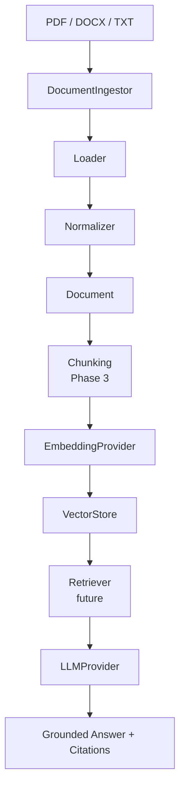
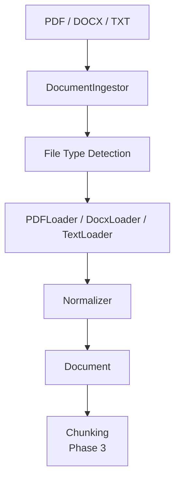

# DocIntel RAG

A local-first Retrieval-Augmented Generation platform for document ingestion, semantic retrieval, grounded question answering, source citations, and retrieval evaluation.

## Overview

DocIntel RAG is an original AI engineering portfolio and client-demo project. It is designed to help teams query trusted document collections such as policy manuals, support documentation, technical references, contracts, and research archives.

Phase 2 adds local document ingestion for extractable-text PDF, DOCX, and TXT files. Retrieval, chunking, vector storage, APIs, and UI work are intentionally reserved for later phases.

## Why RAG

Large language models are powerful, but they do not automatically know private or changing business documents. Retrieval-Augmented Generation connects a model to relevant source passages at answer time, which improves grounding, allows citations, and makes document intelligence systems easier to inspect and evaluate.

## Project Goals

- Ingest and normalize useful document collections.
- Split documents into retrievable chunks.
- Generate embeddings with swappable providers.
- Store and search vectors locally.
- Answer questions using retrieved context.
- Return source citations with grounded answers.
- Evaluate retrieval and answer quality.

## Architecture



## Current Phase 2 Capabilities

- Python project structure for a RAG platform.
- Pydantic settings loaded from environment variables and `.env`.
- Ollama LLM provider using the OpenAI-compatible endpoint.
- Sentence-transformers embedding provider with lazy model loading.
- Domain models for documents, chunks, embedded chunks, and citations.
- Vector store interface prepared for a future ChromaDB implementation.
- Health service for configuration and Ollama reachability checks.
- CLI smoke tests for local generation and embeddings.
- Local document ingestion for PDF, DOCX, and TXT files.
- Text normalization with paragraph boundaries preserved.
- Deterministic SHA-256 document IDs based on file contents.
- CLI document inspection and ingestion summaries.
- Unit tests with mocked external dependencies.
- Ruff lint configuration.

## Technology Stack

- Python 3.12+
- uv
- Ollama
- OpenAI-compatible Ollama endpoint
- PyMuPDF
- python-docx
- sentence-transformers
- Pydantic
- pydantic-settings
- python-dotenv
- pytest
- Ruff

LangChain, ChromaDB, FastAPI, Gradio, OCR frameworks, and cloud document APIs are intentionally not included in Phase 2.

## Prerequisites

- Python 3.12 or newer
- uv
- Ollama installed locally
- At least one supported local Ollama model, such as `llama3.2`

## Ollama Setup

Install Ollama from the official project site, then pull the default generation model:

```bash
ollama pull llama3.2
```

Optional Gemma smoke test support:

```bash
ollama pull gemma3
```

DocIntel uses Ollama's OpenAI-compatible endpoint:

```text
http://localhost:11434/v1
```

## uv Setup

Install dependencies:

```bash
uv sync
```

Copy the example environment file if you want local overrides:

```bash
cp .env.example .env
```

No OpenAI API key is required.

## Document Ingestion

DocIntel currently supports local, text-only ingestion for:

- PDF files with extractable text
- DOCX files with paragraphs, headings, and simple tables
- TXT files, primarily UTF-8 with safe fallback handling

Each ingested file is normalized into the shared `Document` domain model. The ingestion layer does not persist files or send private documents to a cloud API.



### PDF Behavior

PDF extraction uses PyMuPDF page by page. The resulting text keeps page markers such as `[Page 1]` where text is available. Metadata may include page count, author, title, and subject.

Scanned or image-only PDFs are not supported yet. If little or no readable text can be extracted, DocIntel raises a clear scanned-document extraction error instead of attempting OCR.

### DOCX Behavior

DOCX extraction uses python-docx. It reads paragraphs and headings as document text and converts simple table rows into readable pipe-separated rows. Complex page layout reconstruction is out of scope for this phase.

### TXT Behavior

TXT ingestion uses standard Python file handling. UTF-8 and UTF-8 with BOM are preferred, with a conservative Windows text fallback for common local files. Empty files are rejected cleanly.

### Text Normalization

The shared normalizer removes null characters, normalizes line endings, trims lines, collapses repeated spaces, and reduces excessive blank lines. It preserves paragraph boundaries, headings, and meaningful newlines instead of flattening the document into one line.

### Deterministic Document IDs

Document IDs are generated from the SHA-256 hash of file contents:

```text
sha256:<digest>
```

The same file contents produce the same ID even if the filename changes. Different contents produce different IDs.

## Running Health Checks

```bash
uv run python -m app.main
```

Expected output shape:

```text
DocIntel RAG
Ollama: reachable
Generation model: llama3.2
Embedding model: sentence-transformers/all-MiniLM-L6-v2
```

## LLM Smoke Tests

Default model:

```bash
uv run python -m app.main --llm-test
```

Gemma model override:

```bash
uv run python -m app.main --llm-test --model gemma3
```

## Embedding Smoke Test

```bash
uv run python -m app.main --embedding-test
```

This prints the configured embedding model and vector dimension, not the full vector.

## Document Ingestion CLI

Ingest and summarize a local document:

```bash
uv run python -m app.main --ingest path/to/file.pdf
```

Inspect a document without persistence:

```bash
uv run python -m app.main --inspect path/to/file.docx
```

The CLI prints filename, document ID, source type, character count, word count, PDF pages when available, metadata, and a short preview. It does not print the full document.

## Client Demo Direction

The finished system is intended to support demo collections such as:

- Employee Handbook
- Company Policies
- Product Documentation
- Customer Support Knowledge Base

Example Employee Handbook collection:

- PTO policy
- Remote work policy
- Expense policy
- Security policy

Later users will ask questions such as:

- How many PTO days do employees receive?
- What expenses require manager approval?

These demo collections and RAG answers are not built in Phase 2.

## Security And Privacy

DocIntel is local-first. Phase 2 ingestion is designed so private documents can be parsed locally without being sent to a cloud document API.

The repository ignores local document and runtime directories:

- `uploads/`
- `data/`
- `runtime/`

Do not commit private client documents, `.env` files, model caches, logs, or generated runtime data.

## Planned Roadmap

1. Core providers & domain foundation complete
2. Document ingestion complete
3. Chunking, embeddings & ChromaDB
4. Retrieval & grounded Q&A
5. RAG evaluation
6. FastAPI backend
7. Gradio client demo
8. Observability, deployment & portfolio release

## Development

Run unit tests:

```bash
uv run pytest
```

Run lint checks:

```bash
uv run ruff check .
```
