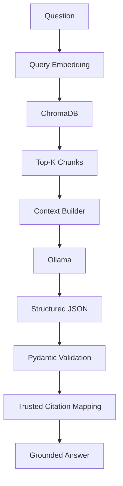

# DocIntel RAG

A local-first Retrieval-Augmented Generation platform for document ingestion, semantic retrieval, grounded question answering, source citations, and retrieval evaluation.

## Overview

DocIntel RAG is an original AI engineering portfolio and client-demo project for querying trusted document collections such as employee policies, support documentation, product manuals, compliance references, contracts, and internal technical documentation.

Phase 4 adds the first complete grounded RAG workflow. A user question is embedded, matched against indexed ChromaDB chunks, formatted into source-numbered context, sent to a local Ollama model, parsed as structured JSON, and mapped back to trusted retrieval records for citations.

Semantic retrieval decides which passages are relevant. The LLM only receives those passages and must answer from them. Citations are mapped back to retrieval results, not generated freely by the model.

## Why RAG

Large language models are powerful, but they do not automatically know private or changing business documents. Retrieval-Augmented Generation connects a model to relevant source passages at answer time, which improves grounding, allows citations, and makes document intelligence systems easier to inspect and evaluate.

## Architecture



## Current Phase 4 Capabilities

- Local document ingestion for PDF, DOCX, and TXT files.
- Text normalization with paragraph boundaries preserved.
- Recursive character-oriented chunking with configurable size and overlap.
- Batch embedding generation using sentence-transformers.
- Persistent ChromaDB vector storage under `./data/chroma` by default.
- Idempotent indexing with deterministic document and chunk IDs.
- Semantic vector search over indexed chunks.
- Grounded question answering with local Ollama models.
- Structured JSON model responses validated with Pydantic.
- Source-number citation mapping from retrieval results.
- Explicit insufficient-information behavior.
- CLI workflows for indexing, search, asking, stats, delete, clear, JSON output, and retrieval debug.

## Grounded Generation Flow

```text
question
-> Retriever
-> top-k RetrievalResult values
-> ContextBuilder source blocks
-> grounded prompt
-> LLMProvider
-> JSON parser
-> Citation mapping
-> GroundedAnswer
```

The context builder formats each retrieved chunk as a stable source block:

```text
[SOURCE 1]
Filename: employee_handbook.txt
Chunk: 0
Distance: 0.21
Content:
Employees receive 15 days of paid time off each calendar year.
```

The model is asked to return only:

```json
{
  "answer": "string",
  "answered": true,
  "source_numbers": [1]
}
```

The application maps `source_numbers` back to trusted `RetrievalResult` objects. The model is never trusted to invent filenames, document IDs, chunk IDs, page numbers, or citation metadata.

## Insufficient Information

When retrieval returns no results, DocIntel does not call the LLM. It returns:

```text
The indexed documents do not contain enough information to answer this question.
```

The prompt also instructs the model to use that exact answer when retrieved context does not contain enough evidence. In that case `answered=false` and citations are empty.

## Context Limits

`MAX_RAG_CONTEXT_CHARS` defaults to `12000`. If retrieved context exceeds the limit, DocIntel keeps highest-ranked chunks first and includes complete chunks where possible. If a single chunk exceeds the limit, it is truncated deterministically.

No token-counting dependency is used yet.

## Retrieval And Distance

Vector search compares embeddings, not exact keywords. ChromaDB returns numeric distances, where lower is closer. DocIntel labels these values as `distance` and does not treat them as similarity scores.

No arbitrary retrieval-distance cutoff is applied in Phase 4. The system relies on top-k retrieval plus the model's grounded evidence decision.

## CLI Workflows

Index a document:

```bash
uv run python -m app.main --index path/to/handbook.txt
```

Ask a grounded question:

```bash
uv run python -m app.main --ask "How many PTO days do employees receive?"
```

Use a specific local model:

```bash
uv run python -m app.main --ask "How many PTO days do employees receive?" --model llama3.2
uv run python -m app.main --ask "How many PTO days do employees receive?" --model gemma3
```

Control retrieval count:

```bash
uv run python -m app.main --ask "What expenses require manager approval?" --top-k 3
```

Filter to one or more documents:

```bash
uv run python -m app.main --ask "What is the PTO policy?" --document-id sha256:<id>
```

Show retrieval evidence:

```bash
uv run python -m app.main --ask "How many PTO days do employees receive?" --show-retrieval
```

Return JSON:

```bash
uv run python -m app.main --ask "What expenses require manager approval?" --output json
```

Inspect retrieval without generation:

```bash
uv run python -m app.main --search "expense approval" --top-k 3
```

Index stats:

```bash
uv run python -m app.main --index-stats
```

Clear the local index:

```bash
uv run python -m app.main --clear-index --yes
```

`--clear-index` requires `--yes`.

## Configuration

Default settings:

```text
OLLAMA_BASE_URL=http://localhost:11434/v1
DEFAULT_MODEL=llama3.2
EMBEDDING_MODEL=sentence-transformers/all-MiniLM-L6-v2
CHUNK_SIZE=800
CHUNK_OVERLAP=120
TOP_K=5
CHROMA_PATH=./data/chroma
CHROMA_COLLECTION=docintel
MAX_RAG_CONTEXT_CHARS=12000
```

`CHUNK_OVERLAP` must be smaller than `CHUNK_SIZE`.

## Client Value

Phase 4 is useful for prototypes and client demos around:

- Employee policy assistants
- Compliance documentation
- Product manuals
- Support knowledge bases
- Internal technical documentation

DocIntel provides grounded answers with citations, but it does not claim legal, HR, compliance, or audit guarantees.

## Demo Collection Direction

The future Employee Handbook Demo can include:

- PTO policy
- Remote work policy
- Expense policy
- Security policy

Example questions:

- How many PTO days do employees receive?
- What expenses require manager approval?
- How many remote days are allowed?
- What does the handbook say about something not present?

## Security And Privacy

DocIntel is local-first. Private documents can be parsed, embedded, indexed, and queried locally without being sent to a cloud document API.

The repository ignores:

- `.env`
- `.venv/`
- `data/`
- `uploads/`
- `runtime/`
- `*.log`

Do not commit private client documents, Chroma databases, embeddings, model downloads, logs, or generated runtime data. Avoid logging full private documents.

## Current Limitations

- No FastAPI backend yet.
- No Gradio client demo yet.
- No reranker.
- No agents.
- No OCR for scanned PDFs.
- No retrieval evaluation suite yet.
- Chunking is character-oriented, not tokenizer-based.

## Technology Stack

- Python 3.12+
- uv
- Ollama
- OpenAI-compatible Ollama endpoint
- PyMuPDF
- python-docx
- sentence-transformers
- ChromaDB
- Pydantic
- pydantic-settings
- python-dotenv
- pytest
- Ruff

LangChain, FAISS, Pinecone, Qdrant, FastAPI, Gradio, OCR frameworks, and cloud document APIs are intentionally not included in Phase 4.

## Planned Roadmap

1. Core providers & domain foundation ✅
2. Document ingestion ✅
3. Chunking, embeddings & ChromaDB ✅
4. Retrieval & grounded Q&A ✅
5. RAG evaluation
6. FastAPI backend
7. Gradio client demo
8. Observability, deployment & portfolio release

## Development

Install dependencies:

```bash
uv sync
```

Run unit tests:

```bash
uv run pytest
```

Run lint checks:

```bash
uv run ruff check .
```
