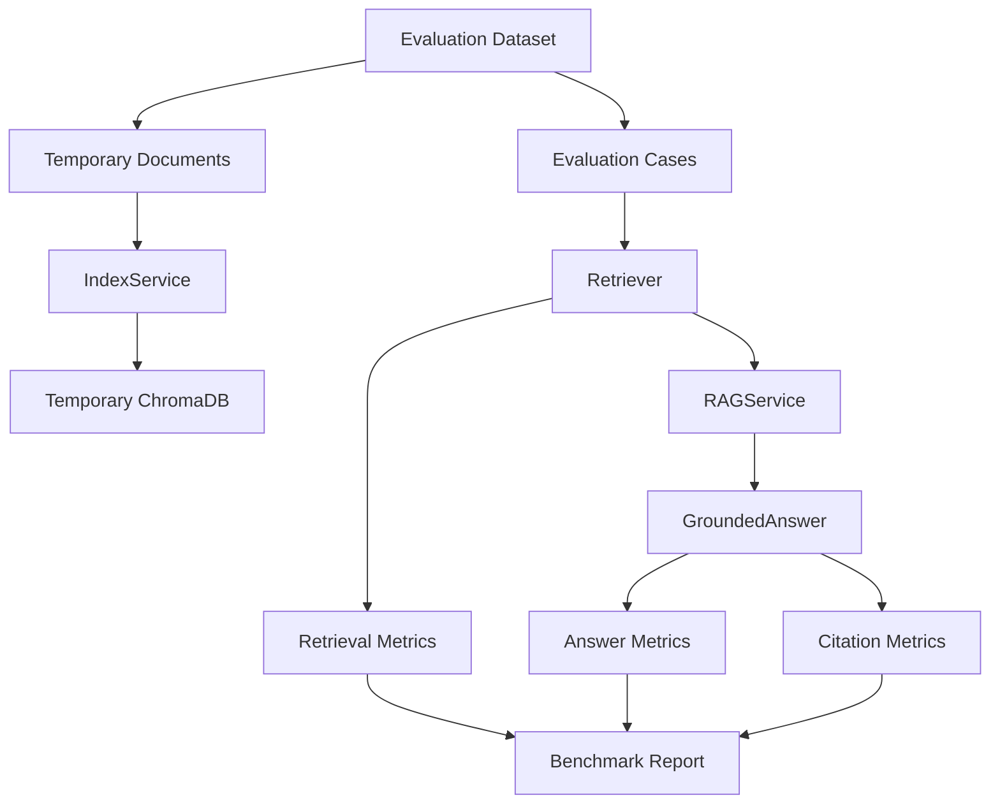
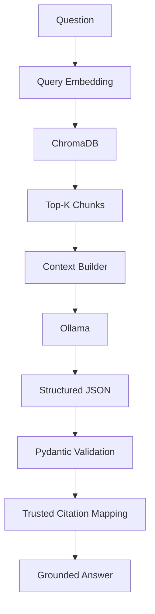

# DocIntel RAG

A local-first Retrieval-Augmented Generation platform for document ingestion, semantic retrieval, grounded question answering, source citations, and retrieval evaluation.

## Overview

DocIntel RAG is an original AI engineering portfolio and client-demo project for querying trusted document collections such as employee policies, support documentation, product manuals, compliance references, contracts, and internal technical documentation.

Phase 5 adds a rigorous but lightweight RAG evaluation framework. The project can now run a repeatable benchmark that measures retrieval quality, grounded answer correctness, citation correctness, insufficient-information behavior, parse success, model reliability, and latency.

Good RAG requires testing retrieval separately from generation. If retrieval is wrong, a stronger LLM may still answer poorly because it never receives the right evidence. If retrieval is correct but the answer fails, the issue is more likely prompt behavior, structured parsing, or model reliability.

## Architecture



The normal RAG path remains:



## Current Phase 5 Capabilities

- Local document ingestion for PDF, DOCX, and TXT files.
- Recursive chunking, batch embeddings, persistent ChromaDB storage, and semantic search.
- Grounded question answering with source-number citation mapping.
- Synthetic benchmark dataset under `benchmarks/rag_eval.json`.
- Retrieval-only benchmark mode that avoids Ollama.
- Full RAG benchmark mode for `llama3.2`, `gemma3`, or another configured Ollama model.
- Deterministic metrics for retrieval, answer text, citations, unknown-answer behavior, parse success, and latency.
- Text and JSON benchmark output.
- Optional JSON result saving under ignored paths such as `runtime/evaluations/result.json`.
- Failed-case analysis for practical RAG iteration.

## Benchmark Dataset

`benchmarks/rag_eval.json` is a safe synthetic employee-policy benchmark. It includes three tiny documents:

- `employee_handbook.txt`
- `expense_policy.txt`
- `security_policy.txt`

It has 10 evaluation cases:

- 6 answerable single-source questions
- 2 answerable multi-source questions
- 2 unanswerable questions

The benchmark is intentionally small so it can run locally and be repeated after future changes.

## Retrieval Metrics

Retrieval relevance is evaluated against expected source documents, not perfect semantic relevance.

- `Hit@K`: at least one expected document appears in retrieved results.
- `Recall@K`: the fraction of expected documents retrieved.
- `MRR`: reciprocal rank of the first expected document.
- Expected document coverage: source coverage for multi-document cases.
- Retrieved filenames, distances, and ranks are recorded per case.

ChromaDB distances are reported as distances, not similarity scores.

## Answer Metrics

Answer checks are deterministic and intentionally transparent:

- Expected phrase coverage uses case-insensitive normalized substring matching.
- Answerable cases should return `answered=true`.
- Expected answer phrases must appear in the answer.
- Citations should be present for answerable cases.
- Expected citation documents should be covered.

This is not a human semantic judge. It catches regressions and obvious failures, but it does not replace manual review.

## Citation Metrics

Citations are mapped from trusted retrieval records, not model-generated metadata.

- Citation precision: fraction of cited documents that are expected.
- Citation recall: fraction of expected source documents that were cited.
- Citation correctness: answerable cases require expected citation coverage.

For multi-source cases, expected source coverage matters.

## Unknown-Answer Evaluation

Unanswerable cases should return:

```text
The indexed documents do not contain enough information to answer this question.
```

They should also return `answered=false` and no citations.

## Pass/Fail Policy

Answerable case pass:

- Retrieval hit is true.
- Answer contains all expected phrases.
- Citation recall is 100%.
- Parse succeeded.

Unanswerable case pass:

- `answered=false`.
- The insufficient-information phrase is returned.
- Citations are empty.
- Parse succeeded.

Retrieval-only case pass:

- Answerable cases require retrieval hit.
- Unanswerable cases are treated as retrieval-only pass because generation is intentionally skipped.

## CLI Workflows

Run the full benchmark with llama3.2:

```bash
uv run python -m app.main --evaluate benchmarks/rag_eval.json --model llama3.2
```

Run the full benchmark with gemma3:

```bash
uv run python -m app.main --evaluate benchmarks/rag_eval.json --model gemma3
```

Run retrieval-only evaluation without Ollama:

```bash
uv run python -m app.main --evaluate benchmarks/rag_eval.json --evaluate-retrieval
```

Return JSON:

```bash
uv run python -m app.main --evaluate benchmarks/rag_eval.json --model llama3.2 --output json
```

Save JSON output:

```bash
uv run python -m app.main --evaluate benchmarks/rag_eval.json --model llama3.2 --save runtime/evaluations/result.json
```

The runner creates an isolated temporary ChromaDB path for each evaluation run and cleans it up afterward.

## Model Comparison

Run the same dataset against multiple models and compare:

```text
Model   Answer Accuracy   Citation Recall   Unknown Accuracy   Avg Latency
```

DocIntel does not declare a universal winner automatically. A model may be more accurate but slower, or faster but less reliable.

## Failure Analysis

Text output lists failed cases with:

- Case ID
- Question
- Expected documents
- Retrieved documents
- Answer
- Cited documents
- Error, if any

This helps distinguish retrieval failures from generation, prompting, parsing, or citation issues.

## Client Value

Evaluation makes DocIntel more credible than a simple document chatbot. A client can test:

- Whether their policies are retrievable.
- Whether answers are grounded.
- Whether citations point to expected sources.
- Which questions the system cannot answer reliably.
- How latency changes across models.

No perfect accuracy, legal, HR, compliance, or audit guarantee is implied.

## Core RAG CLI

Index a document:

```bash
uv run python -m app.main --index path/to/handbook.txt
```

Ask a grounded question:

```bash
uv run python -m app.main --ask "How many PTO days do employees receive?"
```

Show retrieval evidence:

```bash
uv run python -m app.main --ask "How many PTO days do employees receive?" --show-retrieval
```

Inspect retrieval without generation:

```bash
uv run python -m app.main --search "expense approval" --top-k 3
```

## Configuration

Default settings:

```text
OLLAMA_BASE_URL=http://localhost:11434/v1
DEFAULT_MODEL=llama3.2
EMBEDDING_MODEL=sentence-transformers/all-MiniLM-L6-v2
CHUNK_SIZE=800
CHUNK_OVERLAP=120
TOP_K=5
CHROMA_PATH=./data/chroma
CHROMA_COLLECTION=docintel
MAX_RAG_CONTEXT_CHARS=12000
```

`CHUNK_OVERLAP` must be smaller than `CHUNK_SIZE`.

## Security And Privacy

DocIntel is local-first. Private documents can be parsed, embedded, indexed, queried, and evaluated locally without being sent to a cloud document API.

The repository ignores:

- `.env`
- `.venv/`
- `data/`
- `uploads/`
- `runtime/`
- `*.log`

Do not commit private client documents, Chroma databases, embeddings, model downloads, logs, generated benchmark outputs, or runtime data.

## Current Limitations

- No FastAPI backend yet.
- No Gradio client demo yet.
- No external LLM judge by default.
- No reranker.
- No agents.
- No OCR for scanned PDFs.
- Chunking is character-oriented, not tokenizer-based.
- Deterministic answer grading uses substring checks and can penalize semantically correct but differently phrased answers.

## Technology Stack

- Python 3.12+
- uv
- Ollama
- OpenAI-compatible Ollama endpoint
- PyMuPDF
- python-docx
- sentence-transformers
- ChromaDB
- Pydantic
- pydantic-settings
- python-dotenv
- pytest
- Ruff

LangChain, FAISS, Pinecone, Qdrant, FastAPI, Gradio, OCR frameworks, and cloud document APIs are intentionally not included in Phase 5.

## Planned Roadmap

1. Core providers & domain foundation ✅
2. Document ingestion ✅
3. Chunking, embeddings & ChromaDB ✅
4. Retrieval & grounded Q&A ✅
5. RAG evaluation ✅
6. FastAPI backend
7. Gradio client demo
8. Observability, deployment & portfolio release

## Development

Install dependencies:

```bash
uv sync
```

Run unit tests:

```bash
uv run pytest
```

Run lint checks:

```bash
uv run ruff check .
```
